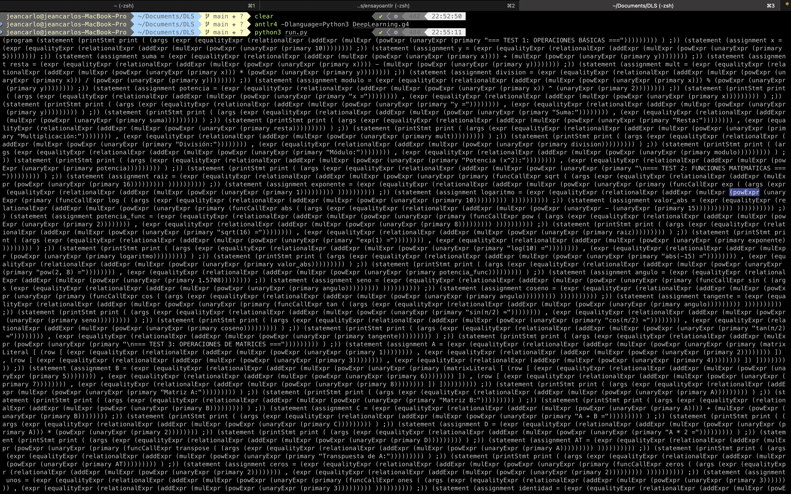

## Construcción del DSL 

Para el siguiente proyecto se realizó un Lenguaje de Dominio específico para realizar procesos de deep Learning, el cual esta integrado a través de una gramática establecida por el lenguaje ANTLR en adición con el uso de Python para la parte de definición gramatical.

## DeepLearning.g4

Este archivo contiene la definición formal de la gramática del lenguaje DeepLearning, diseñada utilizando ANTLR4. Su propósito es describir la estructura sintáctica del lenguaje y definir las reglas mediante las cuales un programa escrito en DeepLearning puede ser reconocido, analizado y posteriormente ejecutado por un intérprete. La gramática establece todos los componentes esenciales del lenguaje, tales como declaraciones de variables, operaciones aritméticas, estructuras de control, definición de funciones, llamadas a funciones y soporte para matrices, arreglos y expresiones de machine learning.

La gramática constituye la base del proceso de análisis sintáctico. A partir de ella, ANTLR genera automáticamente un lexer y un parser, los cuales permiten transformar el código fuente en un árbol sintáctico abstracto (AST). Este árbol representa de forma estructurada cada instrucción del lenguaje y es el insumo fundamental que se utilizará en la fase de ejecución mediante el patrón Visitor. De esta manera, el archivo define las capacidades del lenguaje y limita la forma válida en la que los usuarios pueden escribir programas.

El archivo también incluye las reglas de precedencia y asociación de operadores, asegurando que las expresiones matemáticas y lógicas se interpreten de manera correcta y coherente. Esto abarca operaciones de comparación, aritmética, operadores unarios y llamados a funciones dentro de expresiones más complejas. Asimismo, se definen estructuras avanzadas como matrices, ciclos tipo C y tipo Python, condicionales con formatos flexibles y funciones personalizadas.

Además, el archivo incorpora soporte para un conjunto amplio de funcionalidades relacionadas con machine learning y procesamiento numérico, incluyendo redes neuronales, funciones de activación, operaciones matriciales, estadística básica, lectura de archivos y utilidades comunes en entornos de análisis de datos. Cada una de estas características está representada por palabras reservadas y reglas específicas que facilitan su reconocimiento por el parser.

En conjunto, este archivo representa el núcleo sintáctico del proyecto. Todo comportamiento del lenguaje, desde lo más simple hasta lo más complejo, está definido en este documento. Cualquier componente que se desee ejecutar en el intérprete deberá estar previamente descrito en la gramática, lo que convierte a este archivo en la pieza fundamental sobre la cual se construirá el Visitor y la lógica de ejecución completa del lenguaje.

## run.py

El archivo run.py funciona como el punto de entrada principal del proyecto y es responsable de iniciar el proceso completo de análisis sintáctico de un programa escrito en el lenguaje DeepLearning. Este script carga un archivo de entrada con extensión .dl, lo envía al lexer y al parser generados por ANTLR y produce como salida el árbol sintáctico correspondiente. Su función principal es validar que el código ingresado cumple con la estructura definida en la gramática y, en caso contrario, reportar los errores léxicos o sintácticos detectados.

El propósito de este archivo es facilitar la ejecución inicial del lenguaje sin necesidad de integrar todavía la lógica de interpretación. run.py se encarga de configurar el flujo básico: lectura del archivo fuente, tokenización, construcción del árbol sintáctico y visualización de la representación estructurada del programa. Esto permite verificar que la gramática funciona correctamente, que los tokens se reconocen de la manera esperada y que las reglas sintácticas están produciendo el árbol apropiado para cada instrucción.

Además, el script proporciona una base estable para el siguiente componente del proyecto: el Visitor. Una vez que el árbol sintáctico se genera correctamente, run.py puede modificarse para invocar el Visitor que recorrerá el árbol y ejecutará cada operación del lenguaje. De esta forma, el archivo no solo cumple un rol de prueba y validación durante el desarrollo de la gramática, sino que también servirá como punto de conexión entre el análisis sintáctico y la ejecución real del código.

En esencia, run.py es el módulo encargado de coordinar la interacción entre el parser y el archivo fuente que el usuario desea procesar. Su diseño permite ampliar gradualmente el proyecto, comenzando con la verificación gramatical del lenguaje y evolucionando posteriormente hacia un intérprete completo. Gracias a este archivo, el equipo puede aislar y evaluar de manera controlada cada etapa del pipeline del compilador antes de pasar a fases más avanzadas del sistema

## test.dl

El archivo test.dl contiene un conjunto extenso de casos diseñados para evaluar de manera integral todas las características implementadas en la gramática del lenguaje DeepLearning. Este archivo funciona como un programa completo escrito en el lenguaje objetivo y permite verificar si las reglas sintácticas reconocen correctamente las distintas estructuras definidas. Su propósito principal es validar el comportamiento del lexer, del parser y posteriormente del Visitor una vez que se incorpore la etapa de interpretación.

El contenido de test.dl está organizado en secciones temáticas que cubren operaciones básicas, funciones matemáticas, matrices, condicionales, ciclos, funciones personalizadas, manejo de arreglos, operaciones estadísticas y funciones típicas utilizadas en aprendizaje automático. Cada bloque está acompañado de instrucciones print que facilitan visualizar la construcción del árbol sintáctico y verificar que todas las expresiones se procesan adecuadamente. Gracias a su variedad, este archivo sirve como una referencia completa del alcance del lenguaje desarrollado.

Además, test.dl permite identificar y corregir posibles inconsistencias en la gramática, ya que combina estructuras simples con construcciones más complejas que ponen a prueba la robustez del diseño. Su uso continuo durante el desarrollo ayuda a garantizar que el lenguaje soporta correctamente asignaciones, expresiones aritméticas, llamadas a funciones, manejo de matrices y estructuras de control similares a las de lenguajes de alto nivel.

Este archivo será también esencial en la siguiente fase del proyecto, cuando se implemente el Visitor encargado de interpretar el árbol sintáctico. Cada instrucción del test.dl servirá para validar que el recorrido del árbol se ejecuta correctamente y que el intérprete produce los resultados esperados. En conjunto, test.dl actúa como un banco de pruebas fundamental para asegurar la consistencia, estabilidad y completitud del lenguaje DeepLearning
